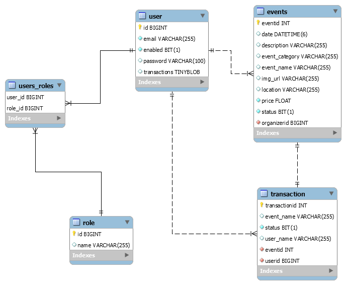

# Relational Schema

## 图示

## 概述

本项目的数据库表结构比较简单，只包含四个实体，但大体的功能还是基本实现了的，后续如果要再增加功能feature，可继续设计更多的实体Model。

对于本项目而言，用户(user)和角色(role)之间是多对多(many-to-many)关系，并由第三方(中间表, user_role)表来维护，变为两个一对多(one-to-many)关系。用户(user)和活动(events)之间是一对多关系(one-to-many)，用户(user)和订单(transaction)之间是一对多关系(one-to-many)，而订单(transaction)和活动(events)之间是一对一关系(one-to-one)，即一个订单仅包含一个活动。