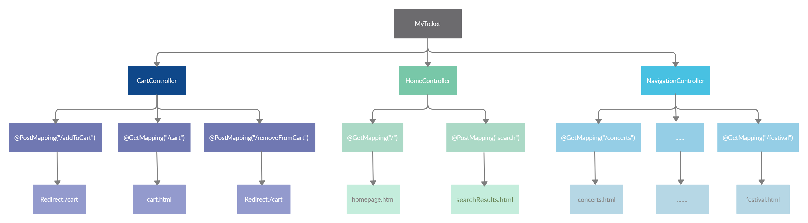
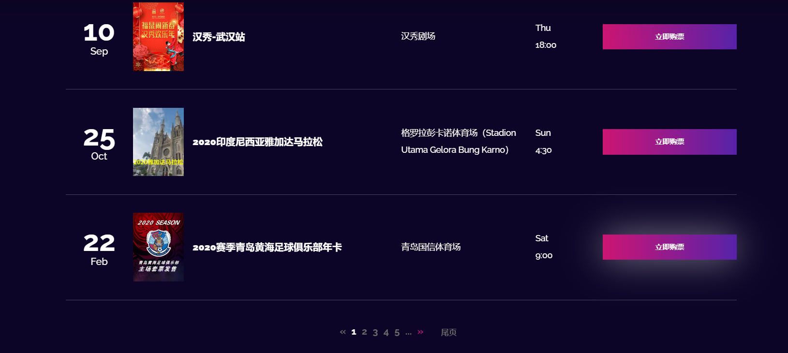
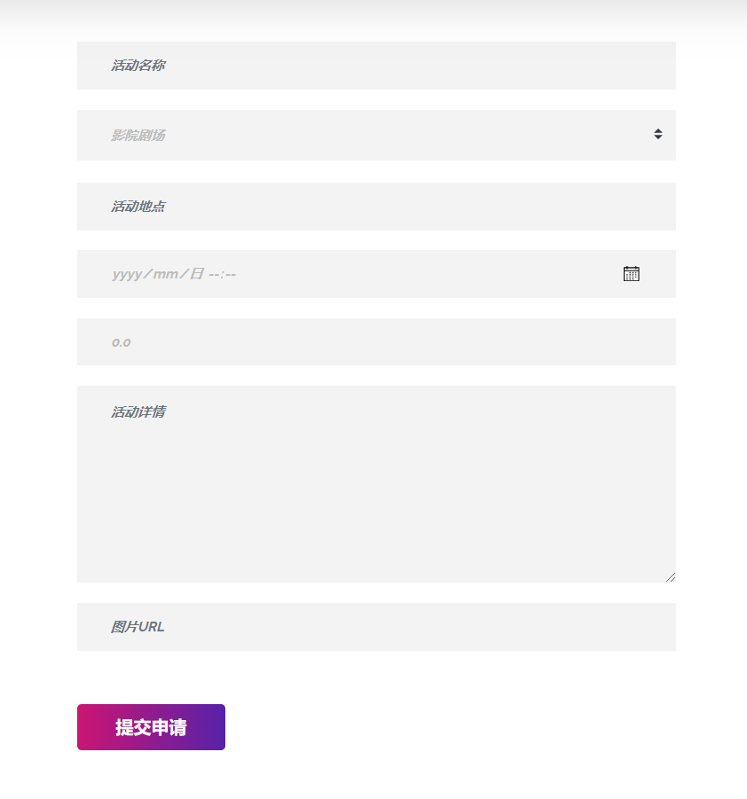
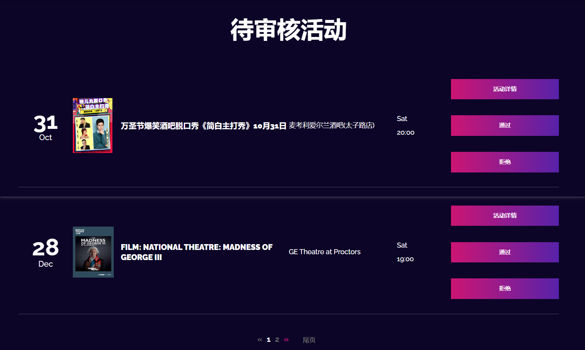
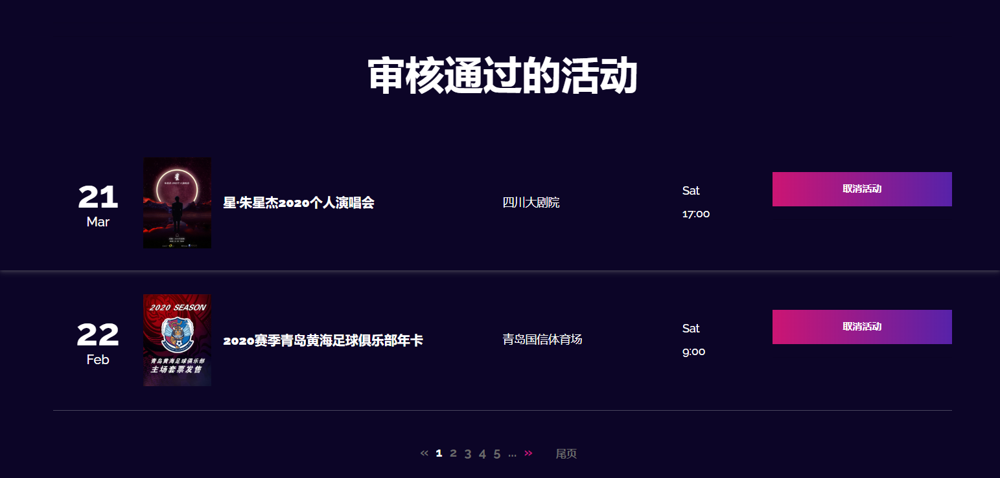
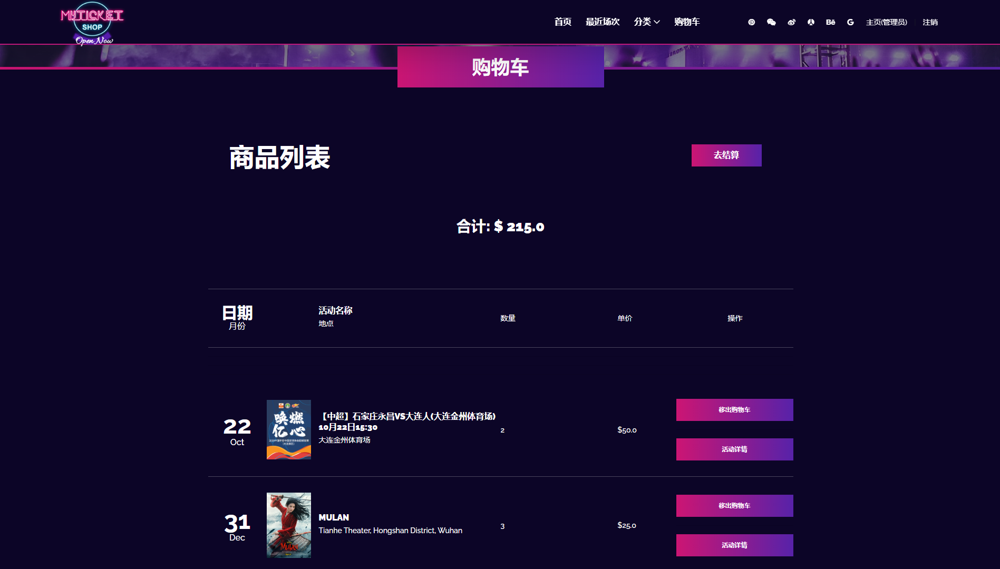

# Controller层
>Controller层负责具体的业务模块流程的控制

## 图示



<br></br>


<br></br>


## 重点解析

### HomeController
`HomeController`的`@GetMapping("/")`会在首页对活动列表分页处理。将`events`和`pager`参数传到`homepage.html`:

```java
@GetMapping("/")
public String homepage(@RequestParam("page") Optional<Integer> page, Model model) {
    //作分页展示: 请求的page参数如果为空或小于0，
    // 则返回默认值，否则返回请求参数的值
    int currentPage = (page.orElse(0) < 1) ? INITIAL_PAGE : page.get()-1;
    // PageRequest实现了AbstractPageRequest（其扩展了Pageable接口），指定分页方式(当前页和单页大小)
    // 注意：传给PageRequest.of(int page, int size)的page.get()要减一，因为其索引从0开始
    Page<Event> events = eventService.findAllEventsPageable(PageRequest.of(currentPage, 15));
    model.addAttribute("events", events);
    Pager pager = new Pager(events);
    model.addAttribute("pager", pager);
    return "homepage";
}
```

前端展示：



### SignUpController

`SignUpController`的`@PostMapping("/signup")`会对注册操作返回成功页面和失败页面。

```java
@RequestMapping(value = "/signup", method = RequestMethod.POST)
public ModelAndView createNewUser(@Valid User user, BindingResult bindingResult) {
    if (userService.findByEmail(user.getEmail()).isPresent()) {
        bindingResult.rejectValue("email", "error.user", "该邮箱已被注册");
    }
    ModelAndView modelAndView = new ModelAndView();
    if (bindingResult.hasErrors()) {
        modelAndView.setViewName("errors/userExistError");
    } else {
        // 注册成功，保存用户
        userService.saveUser(user);
        modelAndView.addObject("successMessage", "用户注册成功");
        modelAndView.addObject("user", new User());
        modelAndView.setViewName("success/signupSuccess");
    }
    return modelAndView;
}
```

前端展示：


### OrganizerController

`OrganizerController`的`@GetMapping("/organizerdashboard")`会向视图View添加一个`newEvent`数据对象，用于接收前端表单的输入，当用户点击`提交申请`按钮时，会访问`@PostMapping("/submitNewEvent")`，对提交的Event对象设置并保存，然后重定向回`redirect:/organizerdashboard`

```java
// @ModelAttribute用于接收表单提交的数据模型
@PostMapping("/submitNewEvent")
public String eventSubmit(@ModelAttribute Event newEvent, @AuthenticationPrincipal User user) {
    System.out.print(newEvent.getEventCategory());
    newEvent.setOrganizerID(user.getId());
    newEvent.setStatus(false);
    eventRepository.save(newEvent);
    return "redirect:/organizerdashboard";
}
```

前端展示：




### AdminController
`AdminController`的`@GetMapping("/admin")`会在页面中出现两种分页，我们分别添加参数：

```java
@GetMapping("/admin")
public String admin(Model model, @RequestParam("page1") Optional<Integer> page1, @RequestParam("page2") Optional<Integer> page2) {
    //作分页展示: 请求的page参数如果为空或小于0，
    // 则返回默认值，否则返回请求参数的值
    int currentPage1 = (page1.orElse(0) < 1) ? INITIAL_PAGE : page1.get()-1;
    int currentPage2 = (page2.orElse(0) < 1) ? INITIAL_PAGE : page2.get()-1;
    // PageRequest实现了AbstractPageRequest（其扩展了Pageable接口），指定分页方式(当前页和单页大小)
    // 注意：传给PageRequest.of(int page, int size)的page.get()要减一，因为其索引从0开始
    Page<Event> unapprovedEvents = eventService.findpaginated(eventRepository.findByStatus(false), PageRequest.of(currentPage1, 10));
    Page<Event> approvedEvents = eventService.findpaginated(eventRepository.findByStatus(true), PageRequest.of(currentPage2, 15));
    Pager pager1 = new Pager(unapprovedEvents);
    Pager pager2 = new Pager(approvedEvents);
    model.addAttribute("pager1", pager1);
    model.addAttribute("pager2", pager2);
    model.addAttribute("unapprovedEvents", unapprovedEvents);
    model.addAttribute("approvedEvents", approvedEvents);
    model.addAttribute("events", eventRepository.findAll());
    return "admindashboard";
}
```
前端显示：





### CartController

`CartController`的`@GetMapping("/cart")`会对购物车列表初始化，并将相关属性(活动列表和购物车总额)添加到ModelAndView。

```java
@GetMapping("/cart")
public ModelAndView getCart(@AuthenticationPrincipal User user) {
    ModelAndView modelAndView = new ModelAndView("cart");
    List<Transaction> transactionList = transactionService.findByUserIDAndStatus(user.getId(), false);
    List<Event> eventList = transactionList.stream()
            .map(t -> eventService.findByEventID(t.getEventID()))
            .collect(Collectors.toList());
    shoppingCartService.initMap(eventList);
    modelAndView.addObject("eventMap", shoppingCartService.getNumOfTickets());
    modelAndView.addObject("total", Float.toString(shoppingCartService.getTotal()));
    return modelAndView;
}
```

前端展示：


