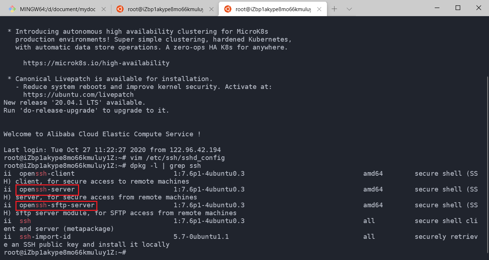
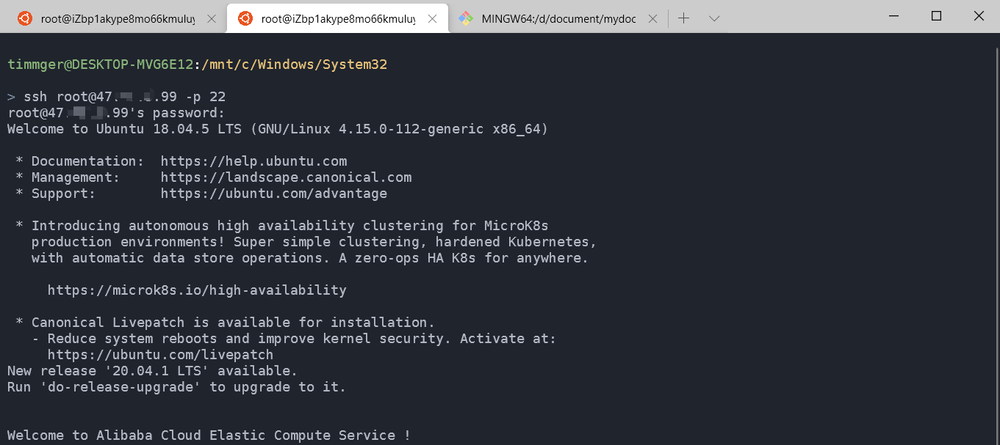
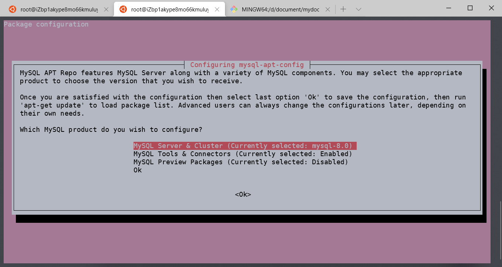
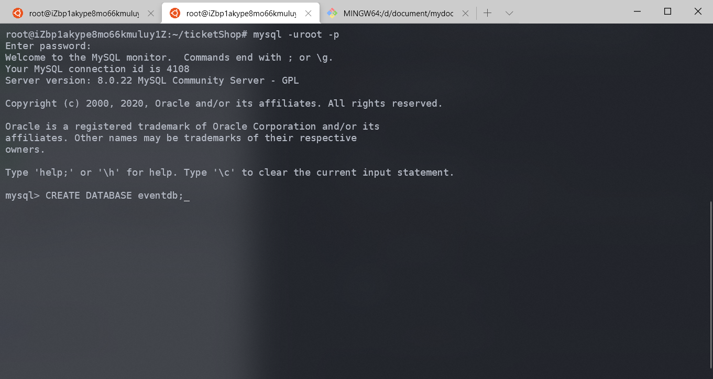
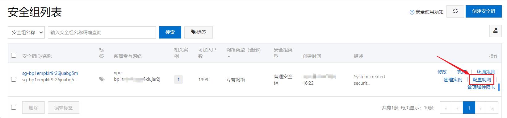
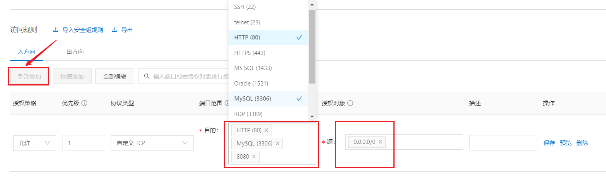
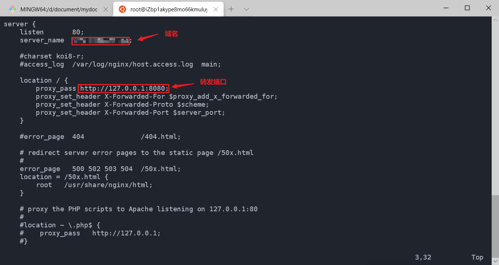

# 打包部署

>本项目并没有使用`Docker`容器化部署或自动化部署方法，而是手动打包上传jar

## 生产环境配置

本项目部署的服务器是阿里云服务器ECS，使用的系统是`Ubuntu 18.04 x86`。

### 远程登录

首先，我们要在服务器上开启SSH远程登录服务:

1. 查看是否安装`ssh-server`服务

```bash
$ dpkg -l | grep ssh
```



2. 如果没有`openssh-server`，要自行安装

```bash
$ sudo apt-get install openssh-server
```

3. 确认`ssh-server`启动，如果出现对应进程，说明启动成功

```bash
$ ps -e | grep ssh
  612 ?        00:00:00 sshd
 1761 ?        00:00:00 sshd
 1814 ?        00:00:00 sshd
```

4. 修改配置文件，如自定义端口(默认22)，确保`PermitRootLogin`为`yes`

```bash
$ vim /etc/ssh/sshd_config
...
PermitRootLogin yes
PasswordAuthentication yes
...
```

5. 本地终端登录
```bash
$ ssh root@[服务器IP] -p [端口]
```


### 安装JDK8

```bash
$ sudo apt-get update
$ sudo apt-get install openjdk-8-jdk
```

查看Java版本：

```bash
$ java -version
openjdk version "1.8.0_265"
OpenJDK Runtime Environment (build 1.8.0_265-8u265-b01-0ubuntu2~18.04-b01)
OpenJDK 64-Bit Server VM (build 25.265-b01, mixed mode)
```

配置环境变量等就不再赘述。

### 安装MySQL 8.0

Ubuntu 18.04默认没有`MySQL 8.0`仓库，需自行获取。

1. 获取最新的Repository:

```bash
$ wget -c https://dev.mysql.com/get/mysql-apt-config_0.8.15-1_all.deb
```

2. 安装Repository
```bash
$  sudo dpkg -i mysql-apt-config_0.8.15-1_all.deb
```


保留默认选项，选择OK退出

3. 刷新仓库并安装

```bash
$ sudo apt-get update
$ sudo apt-get install mysql-server
```
安装过程会进行一系列配置，注意，要确保用户名和密码的设置与开发环境的`application.properties`配置一致。

4. 登入并创建database

```bash
$ mysql -u root -p [密码]
...
```



其他还有开启远程登录配置，如：
```bash
# 创建用户
mysql> CREATE USER '用户名'@'%' IDENTIFIED BY '密码';
# 授予所有权限
mysql> grant all privileges on *.* to '用户名'@'%';
```

### 创建项目目录并开启相关端口

```bash
$ mkdir ticketShop
$ sudo chmod 777 ticketShop/
$ touch ticketShop/myLog.log
$ sudo chmod 777 ticketShop/myLog.log
```

此时，我们要在阿里云控制台开启相关端口。

1. 进入网络与安全-安全组，为实例添加配置规则：



2. 点击手动添加，并开启80、8080、3306端口，并设置源为`0.0.0.0/0`，允许所有访问：



## 本地打包

本项目是使用Spring Boot内嵌的Tomcat容器运行，所以直接打成jar包。

### Maven打包
首先，在`pom.xml`中添加：

```xml
<packaging>jar</packaging>
...
<build>
    <plugins>
        <plugin>
            <groupId>org.springframework.boot</groupId>
            <artifactId>spring-boot-maven-plugin</artifactId>
        </plugin>
        <plugin>
            <groupId>org.apache.maven.plugins</groupId>
            <artifactId>maven-compiler-plugin</artifactId>
            <version>3.8.1</version>
            ....
        </plugin>
    </plugins>
</build>
```

在项目目录执行:

```bash
$ mvn clean package 
```

可在`target`目录中看到打包的jar文件，我们将jar包上传到服务器：

```bash
$ scp event-tickets-order.jar root@[服务器IP]:/root/ticketShop/
```

### 服务器运行

我们在服务器端运行:
```bash
$ cd ticketShop
$ nohup java -jar event-tickets-order.jar > myLog.log &
$ curl localhost:8080
<!DOCTYPE html>
<html>
<head>
    <meta charset="UTF-8">
    <meta name="description" content="">
    <meta http-equiv="X-UA-Compatible" content="IE=edge">
    <meta name="viewport" content="width=device-width, initial-scale=1, shrink-to-fit=no">
    <!-- The above 4 meta tags *must* come first in the head; any other head content must come *after* these tags -->

    <!-- Favicon -->
    <link rel="icon" href="/img/core-img/favicon.ico">

    <!-- Core Stylesheet -->
    ...
```
可以看到，MyTicket项目已经运行在服务器8080端口。此外还可以编写启动和终止脚本，或crontab定时任务，就不再赘述。

此时项目只是本地可以访问，我们还需使用nginx反向代理部署Spring Boot应用。

## Nginx安装和配置

安装就不再赘述，配置如下：
```bash
$ vim /etc/nginx/conf.d/default.conf 
```



浏览器打开访问：<a href="http://121.4.26.253/"></a>

