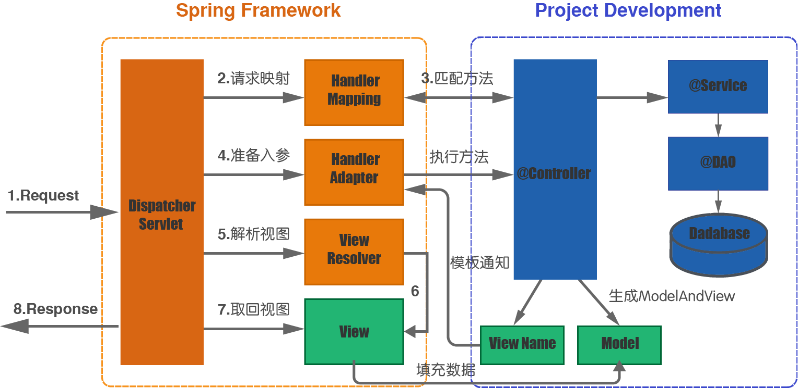
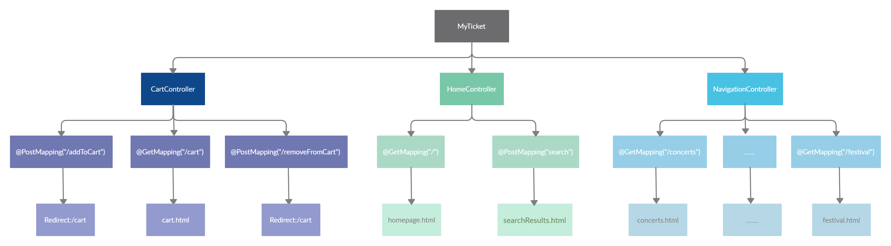
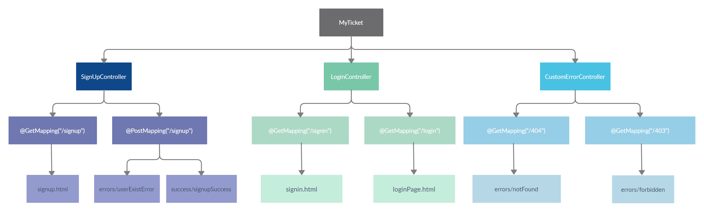
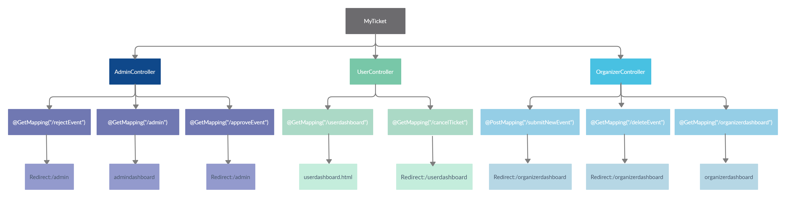

# Spring MVC架构

>MyTicket基于Spring MVC架构的实践

## 简介

`Spring MVC`是一个基于Servlet API和MVC设计理念构建的Web框架，并集成在Spring框架当中，MVC是一种分层理念，它将程序的交互分为了Model 数据处理层，View 视图处理层，Controller 逻辑控制层，有利于扩展和维护。

`Spring MVC`的运作方式围绕着一个中心Servlet类`DispatcherServlet`展开。`DispatcherServlet`可通过`Java Configuration`或`Web.xml`来声明配置，运行时可通过委托的组件来进行请求处理、视图解析、异常处理等操作。

## 图示

## 流程

- 客户端发送URL请求，直接进入统一访问类`DispatcherServlet`
- `DispatcherServlet`根据URL调用`HandlerMapping`处理器映射器(用于解析到对应的Controller)
- 处理器映射器解析对应的Controller，生成对象并返回给`DispatcherServlet`
- `DispatcherServlet`调用`getHandlerAdapter(HandlerMapping)`返回一个处理器适配器`HandlerAdapter`
- `HandlerAdapter`适配器调用`handle()`方法和用户传入的方法参数来真正处理请求
- `Controller`执行方法并生成ModelAndView(包含视图名和数据对象)返回
- `HandlerAdapter`将ModelAndView返回给`DispatcherServlet`，又将之传给`ViewResolver`视图解析器
- `ViewResolver`解析后返回具体View
- Model数据会被填充到View中并渲染视图
- 将结果返回给客户端

## 实践

  

  

