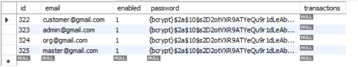
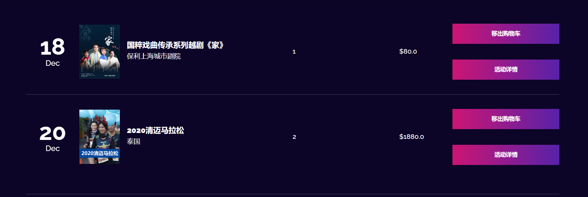
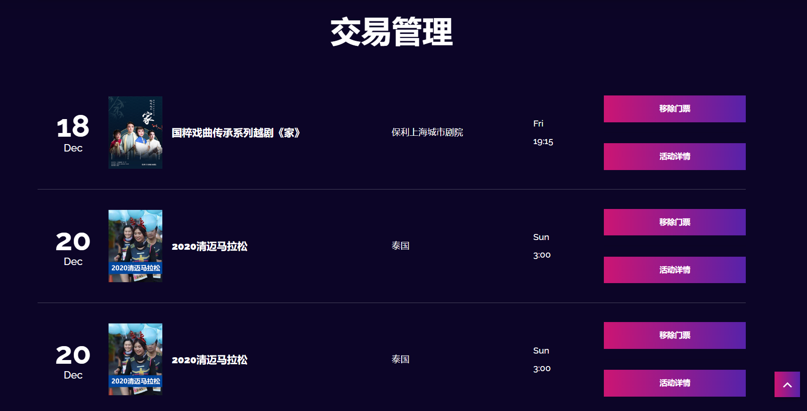
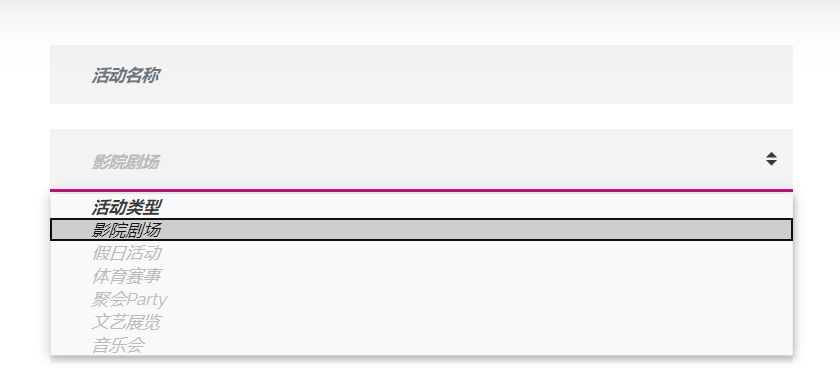
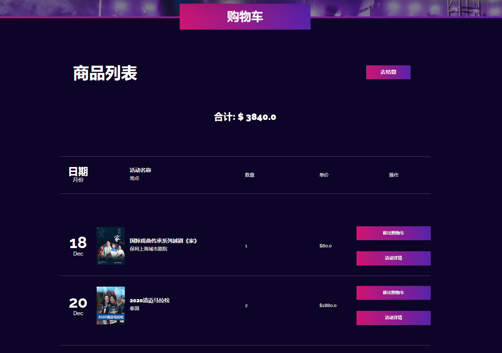

# Service层
>Service层主要负责业务模块的逻辑应用设计

对于Service层，我们要先设计接口，再设计实现类，Service层的业务实现，具体要调用到已定义的Dao层(Repository)的接口，封装Service层的业务逻辑有利于通用的业务逻辑的独立性和重复利用性。

## UserService

UserService定义了三种方法，通过`UserRepository`来实现：

```java
public interface UserService {
    User findById(long id);

    Optional<User> findByEmail(String email);

    User saveUser(User user);

}
```

其中`saveUser()`用于用户注册时，设置用户角色(默认USER_ROLE权限)和密码加密，并存入数据库。

```java
@Override
public User saveUser(User user) {
    user.setPassword(passwordEncoder.encode(user.getPassword()));
    user.setEnabled(true);
    // 将用户角色设为ROLE_USER
    user.addRole(roleRepo.findByName(USER_ROLE));
    return userRepository.saveAndFlush(user);
}
```



`UserService`主要用于`SignUpController`的相关功能实现。

## TransactionService

TransactionService除了常用的CRUD方法外，还包括了一个`addToCart()`方法，用于在添加到购物车的同时，保存到交易记录。

```java
public interface TransactionService {
    ...

    void addToCart(long userID, int eventID);
    
    ...
}
```





TransactionService主要通过`TransactionRepository`来实现，而`addToCart()`还需要`EventService`和`UserService`来生成Transaction对象。

```java
@Override
public void addToCart(long userID, int eventID) {
    Event e = eventService.findByEventID(eventID);
    User u = userService.findById(userID);
    Transaction transaction = new Transaction(u.getId(), u.getEmail(), e.getEventID(), e.getEventName());
    transactionRepository.save(transaction);
}
```

## EventService

`EventService`除了常见的CRUD方法外，还有几个核心方法：

```java
public interface EventService {
   // 找到指定数量的最近场次
    List<Event> findLatest(int num);

    // 找到最近四场
    List<Event> findLatest4();

    // 找到最近五场
    List<Event> findLatest5();

    // 存储活动类型
    Map<String, String> getCategoryMap();

    // 所有活动分页
    Page<Event> findAllEventsPageable(Pageable pageable);

    // 为指定的活动列表分页
    Page<Event> findpaginated(List<Event> eventList, Pageable pageable);
}
```

其中`findLatest(int num)`用于查找指定数量的最近场次的活动，实现如下：

```java
@Override
public List<Event> findLatest(int num) {
    List<Event> eventList = this.eventRepository.findByStatus(true);
    eventList = eventList.stream()
            // 日期大到小排序
            .sorted((e1, e2) -> e2.getDate().compareTo(e1.getDate()))
            .limit(num)
            .collect(Collectors.toList());
    return eventList;
}
```
前端页面显示为：


`getCategoryMap()`用于存储活动类型，实现申请活动类型时的下拉菜单：

```java
@Override
public Map<String, String> getCategoryMap() {
    Map<String, String> map = new HashMap<>();
    map.put("Concert", "音乐会");
    map.put("Sport", "体育赛事");
    map.put("Party", "聚会Party");
    map.put("Theater", "影院剧场");
    map.put("Gallery", "文艺展览");
    map.put("Festival", "假日活动");
    return map;
}
```



分页方法的实现，详情请见[使用Pageable实现分页](pagination.md)

## ShoppingCartService

`ShoppingCartService`用于实现购物车的相关逻辑

```java
public interface ShoppingCartService {
    // 增加某演出活动票数量
    void addTickets(Event event);

    // 增加某演出活动指定数量的票
    void addTickets(Event event, int num);

    // 减少票数量
    void removeTickets(Event event);

    // 初始化购物车列表
    void initMap(List<Event> eventList);

    // 获取相同活动票数量
    Map<Event, Long> getNumOfTickets();

    // 结算
    void checkout();

    // 获取购物车总价值
    float getTotal();
}
```

购物车主要围绕着`Map<Event, Long> eventMap`来实现，指定了活动和票数。增加/减少票数逻辑实现如下：

```java
@Override
public void addTickets(Event event) {
    eventMap.put(event, eventMap.getOrDefault(event, 0L) + 1);
}

@Override
public void addTickets(Event event, int num) {
    eventMap.put(event, eventMap.getOrDefault(event, 0L) + num);
}

@Override
public void removeTickets(Event event) {
    if (eventMap.containsKey(event)) {
        if (eventMap.get(event) > 1) {
            eventMap.put(event, eventMap.get(event) - 1);
        } else if (eventMap.get(event) == 1) {
            eventMap.remove(event);
        }
    }
}
```

每进一次购物车，都要初始化`eventMap`:

```java
// 统计eventList不同活动和相应的票数
@Override
public void initMap(List<Event> eventList) {
    eventMap = eventList.stream()
            .collect(Collectors.groupingBy(Function.identity(), Collectors.counting()));
}

/**
 * 指定的票数
 * 返回不可修改的复制
 * @return
 */
@Override
public Map<Event, Long> getNumOfTickets() {
    return Collections.unmodifiableMap(eventMap);
}

// 获取购物车总价值
@Override
public float getTotal() {
    return eventMap.entrySet().stream()
            .map(entry -> (entry.getKey().getPrice()) * entry.getValue())
            .reduce(Float::sum)
            .orElse(0.00f);
}
```

前端显示如下：

