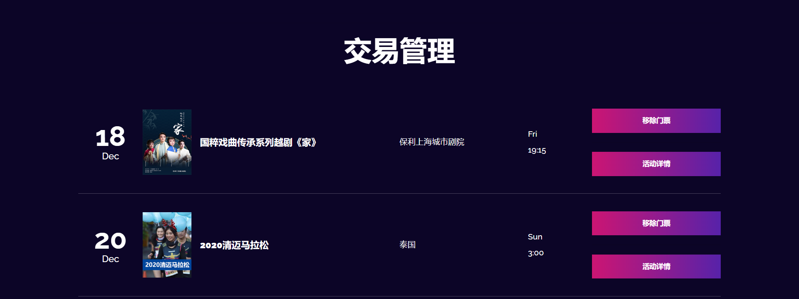

# transaction模块

>订单是一个复合实体，它依赖于用户实体和event实体，分开来看，订单实体也是弱实体，它不可能单独存在。

## 实体Model

```Java
@Entity
@Data
public class Transaction {
    @Id
    @GeneratedValue(strategy = GenerationType.AUTO)
    private int transactionID;
    private long userID;
    private String userName;
    private int eventID;
    private String eventName;
    // 购买状态
    private boolean status;

    public Transaction() {

    }

    public Transaction(long userID, String userName, int eventID, String eventName) {
        this.eventID = eventID;
        this.eventName = eventName;
        this.userID = userID;
        this.userName = userName;
    }
}
```

@Entity注解会创建订单表：

```sql
CREATE TABLE `transaction` (
  `transactionid` int(11) NOT NULL,
  `eventid` int(11) NOT NULL,
  `event_name` varchar(255) DEFAULT NULL,
  `status` bit(1) NOT NULL,
  `userid` bigint(20) NOT NULL,
  `user_name` varchar(255) DEFAULT NULL,
  PRIMARY KEY (`transactionid`)
)  
```

## DAO层
>使用Repository

```java
@Repository
public interface TransactionRepository extends JpaRepository<Transaction, Integer> {
    List<Transaction> findByUserID(long userID);

    List<Transaction> findByUserIDAndStatus(long userID, boolean status);

    List<Transaction> findByUserIDAndEventID(long userID, int eventID);

    Transaction findByTransactionID(int transactionID);

    long deleteByUserID(long userID);

    long deleteByEventName(String eventName);
}
```

## 前端展示

