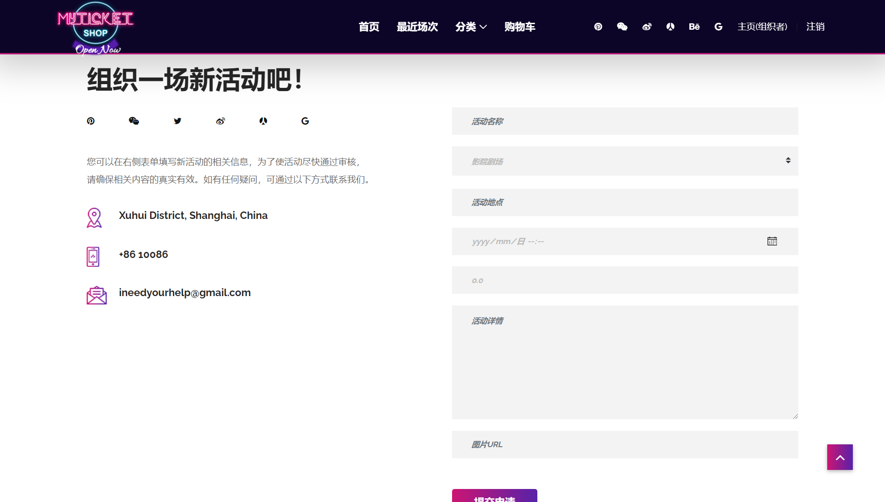

# 用户、角色模块

## 框架工具
>Spring Data JPA

本项目使用到的ORM框架是`Spring Data JPA`, 是JPA的Hibernate实现。通过使用Spring Data JPA，我们可以`简化大量的DAO层的模版代码`(boilerplate)，只需要定义DAO的API接口(继承JPA特定接口 - `JpaRepository`)，我们就可以很轻松的扩展和配置持久层，实现相关的CRUD方法。

## 引入依赖
>在pom中添加相关依赖：

```xml
<dependencies>
        <dependency>
            <groupId>org.springframework.boot</groupId>
            <artifactId>spring-boot-starter-data-jpa</artifactId>
        </dependency>
        
        <dependency>
            <groupId>mysql</groupId>
            <artifactId>mysql-connector-java</artifactId>
            <scope>runtime</scope>
        </dependency>

        ...
</dependencies>
```

## 配置数据源
>添加配置属性

```properties
spring.jpa.hibernate.ddl-auto=update
spring.datasource.url=jdbc:mysql://localhost:3306/eventdb?useUnicode=true&characterEncoding=utf-8&serverTimezone=Asia/Shanghai
spring.datasource.username=root
spring.datasource.password=密码 #输入密码
spring.jpa.show-sql=false
spring.jpa.properties.hibernate.format_sql=true
```

## 用户(User)模块
>用户模块分析

### 实体Model

```java
@Entity
@RequiredArgsConstructor
@NoArgsConstructor
@Data
public class User implements UserDetails {
    @Id
    @GeneratedValue
    private Long id;

    @NonNull
    @Size(min = 6, max = 36)
    @Column(nullable = false, unique = true)
    @Email(message = "*请提供有效的邮箱信息")
    @NotEmpty(message = "*邮箱不能为空")
    private String email;

    @NonNull
    @Column(length = 100)
    @Size(min = 5, message = "*密码至少5个字符")
    @NotEmpty(message = "*密码不能为空")
    private String password;

    @NonNull
    @Column(nullable = false)
    private boolean enabled;

    private int[] transactions;

    //User和Role是多对多关系，指定第三方表users_roles来维护关系
    //inverseJoinColumns写的是被控表在中间表的外键名称
    @ManyToMany(fetch = FetchType.EAGER)
    @JoinTable(
            name = "users_roles",
            joinColumns = @JoinColumn(name = "user_id", referencedColumnName = "id"),
            inverseJoinColumns = @JoinColumn(name = "role_id", referencedColumnName = "id")
    )
    private Set<Role> roles = new HashSet<>();

    @Override
    public Collection<? extends GrantedAuthority> getAuthorities() {
        return roles.stream()
                .map(role -> new SimpleGrantedAuthority(role.getName()))
                .collect(Collectors.toList());
    }

    ...
}
```

`用户实体`包含了六个属性：用户id、邮箱地址、密码、账户状态、订单列表和角色集合(Set<Role>)，其中角色集合交由第三方表(join table)users_roles来维护关系。此外还扩展了UserDetails接口，自定义权限集合。

通过`@Entity`注解可以将实体类名和表名对应，将字段和表中行记录(record)对应。ORM框架将会创建对应的表：

```sql
CREATE TABLE `user` (
  `id` bigint(20) NOT NULL,
  `email` varchar(255) NOT NULL,
  `enabled` bit(1) NOT NULL,
  `password` varchar(100) DEFAULT NULL,
  `transactions` tinyblob,
  PRIMARY KEY (`id`),
  UNIQUE KEY (`email`)
)
```

### DAO层
>使用Repository扩展，DAO层实际上被隐藏了，我们并不直接与它交互

```Java
@Repository
public interface UserRepository extends JpaRepository<User, Long> {
    Optional<User> findById(long id);

    Optional<User> findByEmail(String email);
}
```

通过继承JpaRepository接口，Spring Data就会`根据方法名自动生成查询(query)语句`

当然我们也可以手动查询，通过`@Query()`注解，如：

```java
@Query("SELECT u FROM User u WHERE u.email = :email")
User findByEmail(@Param("email")String email)
```

## 角色(Role)模块
>角色模块分析

### 实体Model

```java
@Entity
@NoArgsConstructor
@RequiredArgsConstructor
@Data
public class Role {
    @Id
    @GeneratedValue
    private Long id;

    //由于@RequiredArgsConstructor,包含@NonNull的字段会生成构造函数
    @NonNull
    private String name;

    //Role和User是多对多关系，指定被控方roles来维护关系
    @ManyToMany(mappedBy = "roles")
    private Collection<User> users;
}
```

@Entity注解会创建角色表：

```sql
CREATE TABLE `role` (
  `id` bigint(20) NOT NULL,
  `name` varchar(255) DEFAULT NULL,
  PRIMARY KEY (`id`)
) 
```

### DAO层

```java
@Repository
public interface RoleRepository extends JpaRepository<Role, Long> {
    Role findByName(String name);
}
```

## 前端展示

>系统预置三种角色：`ROLE_USER、ROLE_ADMIN、ROLE_ORGANIZER`，并在登录页可选择不同身份登录，之后跳转对应管理界面。


>ROLE_USER管理界面：


>ROLE_ORGANIZER管理界面：




>ROLE_ADMIN管理界面：


