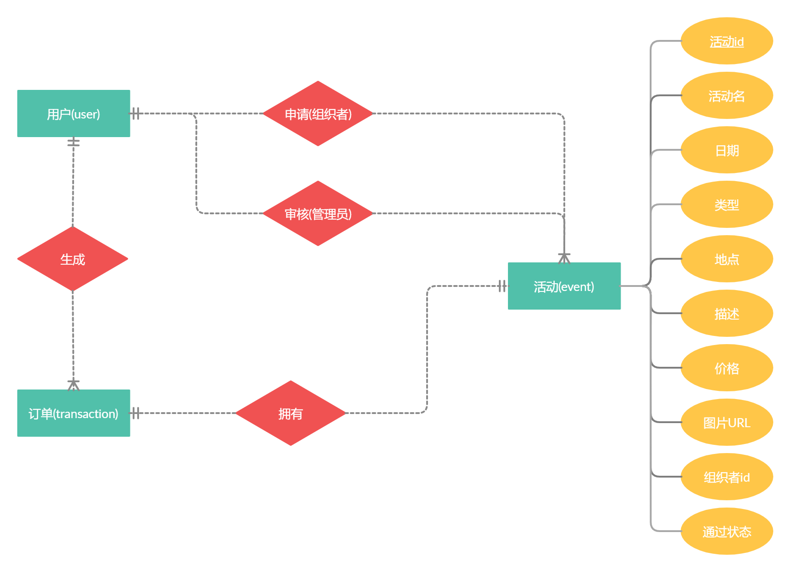
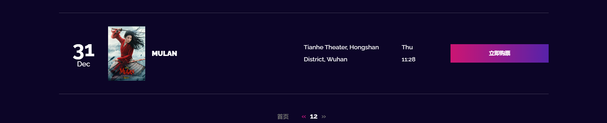

# event模块

>event是实体类的核心，绝大部分功能的实现都是围绕它展开

## 图示



event实体包括十个属性，描述了活动的基本特征，其中声明了组织者ID，可用于实现活动的申请，而活动状态(status)描述了活动是否通过审核。

## 实体Model

```java
@Entity
@Data
@Table(name="events")
public class Event {
    @Id
    @GeneratedValue(strategy = GenerationType.AUTO)
    private int eventID;
    private long organizerID;
    private String eventName;
    private String eventCategory;
    @DateTimeFormat(pattern = "yyy-MM-dd'T'HH:mm")
    private Date date;
    private String location;
    private String description;
    private float price;
    private String imgUrl;
    // 活动是否通过
    private boolean status;

    public Event() {

    }

    public Event(long organizerID, String eventName, String eventCategory, String location, Date date, String description, float price, String imgUrl, boolean status) {
        this.organizerID = organizerID;
        this.eventName = eventName;
        this.eventCategory = eventCategory;
        this.location = location;
        this.date = date;
        this.description = description;
        this.price = price;
        this.imgUrl = imgUrl;
        this.status = status;
    }
```

@Entity注解会创建活动表：

```sql
CREATE TABLE `events` (
  `eventid` int(11) NOT NULL,
  `date` datetime(6) DEFAULT NULL,
  `description` varchar(255) DEFAULT NULL,
  `event_category` varchar(255) DEFAULT NULL,
  `event_name` varchar(255) DEFAULT NULL,
  `img_url` varchar(255) DEFAULT NULL,
  `location` varchar(255) DEFAULT NULL,
  `organizerid` bigint(20) NOT NULL,
  `price` float NOT NULL,
  `status` bit(1) NOT NULL,
  PRIMARY KEY (`eventid`)
) 
```

## DAO层
>使用Repository

```Java
@Repository
public interface EventRepository extends JpaRepository<Event, Integer> {
    List<Event> findByEventCategory(String eventCategory);
    List<Event> findByOrganizerID(Long organizerID);
    List<Event> findByStatus(boolean status);

    Event findByEventID(int eventID);

    List<Event> findByLocationContaining(String location);

    List<Event> findByEventNameContaining(String eventName);

    List<Event> findByEventNameContainingOrLocationContaining(String eventName, String location);
}
```

## 前端展示



