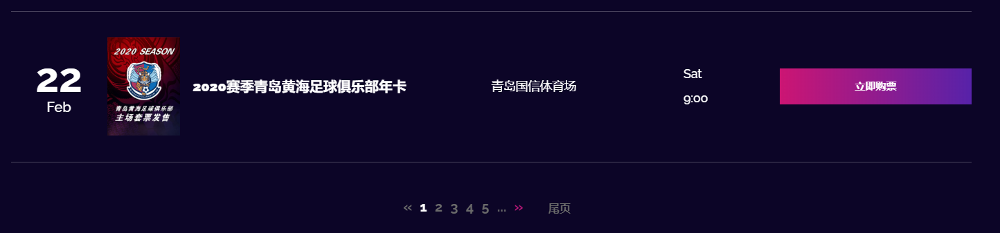

# 使用Pageable实现分页
>MyTicket的分页实现

分页功能有多种实现方式，`MyTicket`项目选择使用的是`Pageable`接口，结合使用`JpaRepository`(扩展了`PagingAndSortingRepository`接口，提供使用分页和排序获取实体的方法)来实现分页，前端使用`Bootstrap`的分页样式组件(可自定义)。

## 概述

`Pageable`是Spring Data库中定义的一个接口，该接口是所有分页相关信息的一个抽象，通过该接口，我们可以得到和分页相关的所有信息（例如pageNumber、pageSize等），这样，Jpa就能够通过pageable参数来得到一个带分页信息的Sql语句。

`PageRequest`实现了AbstractPageRequest（其扩展了Pageable接口），用来指定分页方式(当前页和单页大小)。

## Model类
我们要进行分页的对象是`Event`实体类：

```java
@Entity
@Data
@Table(name="events")
public class Event {
    @Id
    @GeneratedValue(strategy = GenerationType.AUTO)
    private int eventID;
    private long organizerID;
    private String eventName;
    private String eventCategory;
    @DateTimeFormat(pattern = "yyy-MM-dd'T'HH:mm")
    private Date date;
    private String location;
    private String description;
    private float price;
    private String imgUrl;
    // 活动是否通过
    private boolean status;

    ...
}
```

## 分页工具类
>自定义`Pager`类，封装了对`Page`类的一系列常用的相关操作。`Page`类也是`Spring Data`库的接口，它存储了数据的总体信息（数据总数、总页数...）以及当前数据的信息（当前数据的集合、当前页数等）。

```java
/**
 * 分页工具类
 */
public class Pager {
    private final Page<Event> events;

    public Pager(Page<Event> events) {
        this.events = events;
    }
    // 获取当前页的索引(从1开始，events.getNumber()从0开始)
    public int getPageIndex() {
        return events.getNumber() + 1;
    }
    // 返回查询结果页的页尺寸
    public int getPageSize() {
        return events.getSize();
    }
    // 判断是否还有下一页
    public boolean hasNext() {
        return events.hasNext();
    }
    // 判断是否还有上一页
    public boolean hasPrevious() {
        return events.hasPrevious();
    }
    // 获取总页数
    public int getTotalPages() {
        return events.getTotalPages();
    }
    // 获取总元素的数量
    public long getTotalElements() {
        return events.getTotalElements();
    }
    // 判断页码是否超出范围
    public boolean indexOutOfBounds() {
        return this.getPageIndex() <= 0 || this.getPageIndex() > this.getTotalPages();
    }
}
```

## Service

`EventService`接口中定义了两个分页相关方法`findAllEventsPageable()`和`findpaginated()`，分别为对所有活动分页和对指定的eventList分页。  
其中`findAllEventsPageable()`通过`Spring Data Jpa`的命名规范实现，用包含`Pageable`参数的查找方法`findAll(Pageable pageable)`，来对数据库所有的Event分页检索。

```java
public interface EventService {
    Page<Event> findAllEventsPageable(Pageable pageable);

    Page<Event> findpaginated(List<Event> eventList, Pageable pageable);
}
```

以下为实现：

```java
/**
 * 返回选定页的所有Events
 * @param pageable 为指定分页方式的参数
 */
@Override
public Page<Event> findAllEventsPageable(Pageable pageable) {
    return eventRepository.findAll(pageable);
}
/**
 * 自定义分页
 * @param pageable 为指定分页方式的参数
 */
@Override
public Page<Event> findpaginated(List<Event> eventList, Pageable pageable) {
    int pageSize = pageable.getPageSize();
    int currentPage = pageable.getPageNumber();
    int startItem = currentPage * pageSize;
    List<Event> list;
    if (eventList.size() < startItem) {
        list = Collections.emptyList();
    } else {
        int toIndex = Math.min(startItem + pageSize, eventList.size());
        list = eventList.subList(startItem, toIndex);
    }
    Page<Event> eventPage = new PageImpl<Event>(list, PageRequest.of(currentPage, pageSize), eventList.size());
    return eventPage;
}
```

## Controller层

### HomeController

`HomeController`对首页所有的活动分页显示，使用到`findAllEventsPageable()`方法。

```java
private static final int INITIAL_PAGE = 0;

@GetMapping("/")
public String homepage(@RequestParam("page") Optional<Integer> page, Model model) {
    //作分页展示: 请求的page参数如果为空或小于0，
    // 则返回默认值，否则返回请求参数的值
    int currentPage = (page.orElse(0) < 1) ? INITIAL_PAGE : page.get()-1;
    // PageRequest实现了AbstractPageRequest（其扩展了Pageable接口），指定分页方式(当前页和单页大小)
    // 注意：传给PageRequest.of(int page, int size)的page.get()要减一，因为其索引从0开始
    Page<Event> events = eventService.findAllEventsPageable(PageRequest.of(currentPage, 15));
    model.addAttribute("events", events);
    Pager pager = new Pager(events);
    model.addAttribute("pager", pager);
    return "homepage";
}
```

### 其他
其他Controller，诸如导航栏分类显示的`NavigationController`，组织者面板显示申请活动的`OrganizerController`，以及管理员面板显示的审核活动的`AdminController`，则是对特定的event列表分页显示，使用`findpaginated()`方法，如`OrganizerController`的实现：

```java
@GetMapping("/organizerdashboard")
public String eventForm(Model model, @RequestParam("page") Optional<Integer> page, @AuthenticationPrincipal User user) {
    int currentPage = (page.orElse(0) < 1) ? INITIAL_PAGE : page.get()-1;
    Page<Event> events = eventService.findpaginated(eventRepository.findByOrganizerID(user.getId()), PageRequest.of(currentPage, 10));
    Pager pager = new Pager(events);
    model.addAttribute("pager", pager);
    model.addAttribute("events", events);
    ...
    return "organizerdashboard";
}
```

## Thymeleaf模板

最后，我们编写Thymeleaf模板用于前端页面显示，这里使用到Thymeleaf的fragment组件来复用分页显示。

```html
<!--指定分页工具类和URL参数-->
<div th:fragment="pagination(pager,URLparameter)">
    <!--分页-->
    <!--只有总页码数大于0才显示-->
    <nav aria-label="Home and navigation pagination" th:if="${pager.getTotalPages() gt 0}">
        <ul class="pagination justify-content-center font-weight-bold" th:with="baseUrl=${URLParameter}">
            <!--页码超出范围显示-->
            <span th:if="${pager.indexOutOfBounds()}">
                <li class="page-item">
                    <span>页码超出范围，返回<a class="page-link" th:href="@{${baseUrl}(page=1)}">首页</a></span>
                </li>
            </span>
            <!--当前页还有上一页时显示”首页“标签-->
            <li class="page-item" th:if="${pager.hasPrevious()}">
                <a style="font-size: small;margin-top: 3px; padding-right: 20px" class="page-link"
                   th:href="@{${baseUrl}(page=1)}">首页</a>
            </li>
            <!--上一页有效时，自定义"<<"图标颜色-->
            <li class="page-item" th:if="${pager.hasPrevious()}">
                <a style="color: #bd177a" class="page-link" th:href="@{${baseUrl}(page=${pager.getPageIndex()-1})}"
                   aria-label="Previous" title="上一页" data-toggle="tooltip">
                    <span aria-hidden="true">&laquo;</span>
                </a>
            </li>
            <!--上一页失效，"<<"不可点击-->
            <li class="page-item disabled" th:unless="${pager.hasPrevious()}">
                <a class="page-link" href="#">
                    <span aria-hidden="true">&laquo;</span>
                </a>
            </li>
            <!--页码dock栏指定数量为5个，不足5个，显示剩余页码，如果是当前页，则为‘active’，显示不同颜色-->
            <li class="page-item" th:classappend="${i eq pager.getPageIndex()} ? 'active'" th:each="i : ${#numbers.sequence(pager.getPageIndex(), pager.getTotalPages() > (5 + pager.getPageIndex()-1) ? (5+pager.getPageIndex()-1) : (pager.getTotalPages()), 1)}">
                <a class="page-link" th:href="@{${baseUrl}(page=${i})}" th:text="${i}" th:title="${'页码 ' + i}"
                   data-toggle="tooltip"></a>
            </li>
            <!-- 当dock栏(5个)还有剩余页时，才显示更多页(...)标签-->
            <li class="page-item disabled" th:if="${pager.getPageIndex() - 1 + 5 < pager.getTotalPages()}">
                <a class="page-link" href="#">
                    <span aria-hidden="true">...</span>
                </a>
            </li>
            <!--下一页有效，自定义">>"图标颜色-->
            <li class="page-item" th:if="${pager.hasNext()}">
                <a style="color: #bd177a" class="page-link" th:href="@{${baseUrl}(page=${pager.getPageIndex()+1})}"
                   aria-label="Next" title="下一页" data-toggle="tooltip">
                    <span aria-hidden="true">&raquo;</span>
                </a>
            </li>
            <!--下一页失效，">>"不可点击-->
            <li class="page-item disabled" th:unless="${pager.hasNext()}">
                <a class="page-link" href="#">
                    <span aria-hidden="true">&raquo;</span>
                </a>
            </li>
            <!--当前页还有下一页时显示”尾页“标签-->
            <li class="page-item" th:if="${pager.hasNext()}">
                <a style="font-size: small;margin-top: 4px; padding-left: 20px" class="page-link"
                   th:href="@{${baseUrl}(page=${pager.getTotalPages()})}">尾页</a>
            </li>
        </ul>
    </nav>
</div>
```

然后，我们只要在相应的页面复用该组件即可。如`homepage.html`

```html
<!-- ##### 活动列表 ##### -->
<div class="upcoming-shows-area section-padding-100">
    <div class="container">
        ...
        <div class="row">
            <div class="col-12">
                <!-- 内容详情 -->
                <div  class="upcoming-shows-content">
                    <!-- 分列显示 -->
                    <div th:replace="fragments :: single-event-html"></div>
                    <br>
                    <br>
                    <div class="musica-pagination-area">
                        <!-- 分页显示 -->
                        <div th:replace="fragments :: pagination(pager=${pager},URLparameter='/')"></div>
                    </div>
                </div>
            </div>
        </div>
    </div>
</div>
<!-- ##### 活动列表 ##### -->
```

## 前端显示




