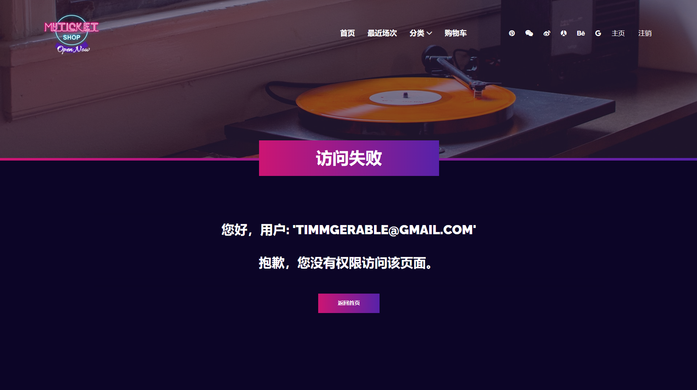
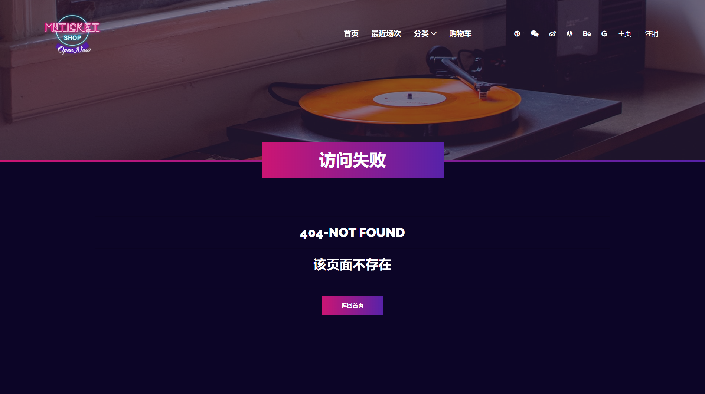
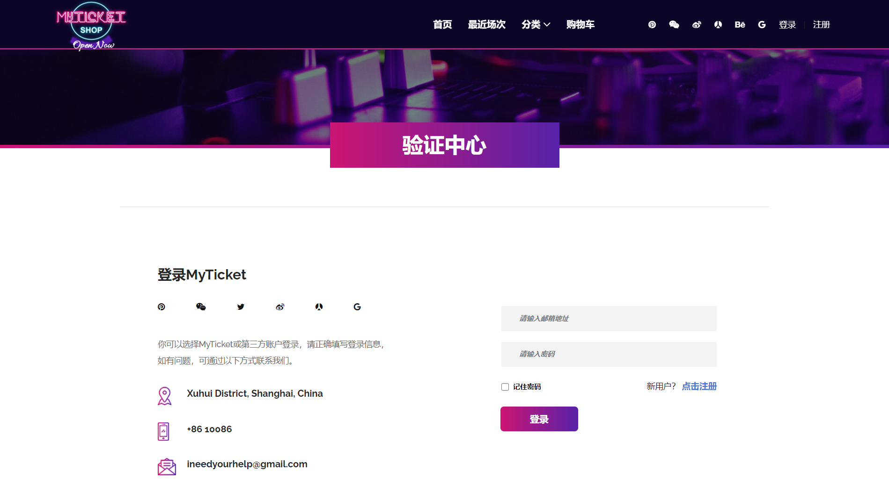

# SpringSecurity实现认证授权
>SpringSecurity是一个功能强大且高度可定制化的安全框架，是基于Spring应用的事实标准。它专注于为Java应用提供认证和授权功能，它的强大在于可以非常方便地扩展功能以满足自定义需求。

## 引入依赖

在pom.xml中添加依赖：
```xml
<dependencies>
    <dependency>
        <groupId>org.springframework.boot</groupId>
        <artifactId>spring-boot-starter-security</artifactId>
    </dependency>
    <!-- 添加thymeleaf对Spring Security的支持 -->
    <dependency>
        <groupId>org.thymeleaf.extras</groupId>
        <artifactId>thymeleaf-extras-springsecurity5</artifactId>
    </dependency>
</dependencies>
```

## 自定义UserDetailsService

`UserDetailsService`是`Spring Security`定义的核心接口，用于根据用户名获取用户信息(`loadUserByUsername()`)，需要自行实现；

```java
@Service
public class UserDetailsServiceImpl implements UserDetailsService{
    private UserRepository userRepository;

    public UserDetailsServiceImpl(UserRepository userRepository) {
        this.userRepository = userRepository;
    }

    @Override
    @Transactional(readOnly = true)
    public UserDetails loadUserByUsername(String email) throws UsernameNotFoundException {
        Optional<User> userOptional = userRepository.findByEmail(email);
        if (!userOptional.isPresent()) {
            throw new UsernameNotFoundException(email);
        }
        return userOptional.get();
    }
}
```

## Security配置类

配置类需要继承`WebSecurityConfigurerAdapter`，重写configure方法来设置安全细节。
- configure(HttpSecurity http)：重写该方法，通过 http 对象的 `authorizeRequests()`方法定义URL访问权限，使用`formLogin().loginPage("/login")`自定义登录页面，使用`exceptionHandling().accessDeniedHandler()`自定义访问权限失败处理方式(如403页面)。

- configure(AuthenticationManagerBuilder auth)：用于配置`UserDetailsService`，添加身份验证。

```java
@Configuration
@EnableWebSecurity
@AllArgsConstructor
public class SecurityConfiguration extends WebSecurityConfigurerAdapter {
    // 自定义UserDetailsService
    private UserDetailsServiceImpl userDetailsService;
    // 自定义AccessDeniedHandler
    private final AccessDeniedHandler accessDeniedHandler;

    @Autowired
    public SecurityConfiguration(AccessDeniedHandler accessDeniedHandler, UserDetailsServiceImpl userDetailsService) {
        this.accessDeniedHandler = accessDeniedHandler;
        this.userDetailsService = userDetailsService;
    }

    @Override
    protected void configure(HttpSecurity http) throws Exception {
        http.authorizeRequests() 
                .antMatchers("/").permitAll() // 允许所有用户访问
                .antMatchers("/admin", "/approveEvent", "/rejectEvent").hasRole("ADMIN")  // 仅允许ROLE_ADMIN用户访问
                .antMatchers("/addToCart", "/cart", "/cancelTicket", "/checkout", "/checkoutSuccess").hasAnyRole("USER", "ADMIN", "ORGANIZER") // 允许ROLE_USER, ROLE_ADMIN, ROLR_ORGANIZER访问
                .antMatchers("/userdashboard").hasRole("USER")
                .antMatchers("/organizerdashboard", "/submitNewEvent", "/deleteEvent").hasRole("ORGANIZER") // 仅允许ROLE_ORGANIZER用户访问
                .and()
                .formLogin() // 自定义登录页
                .loginPage("/login")
                .loginProcessingUrl("/login")
                .and()
                .logout().logoutSuccessUrl("/") // 定义注销返回url
                .and().csrf().disable() // 禁止跨域请求伪造
                .exceptionHandling().accessDeniedHandler(accessDeniedHandler); // 自定义权限失败处理，403页面
    }
    // 添加身份验证
    @Override
    protected void configure(AuthenticationManagerBuilder auth) throws Exception {
        auth.userDetailsService(userDetailsService);
    }

    // PasswordEncoder: SpringSecurity定义的用于对密码进行编码及比对的接口
    @Bean
    public PasswordEncoder passwordEncoder() {
        return PasswordEncoderFactories.createDelegatingPasswordEncoder();
    }
}
```

## 前端展示

**403页面：**



<br></br>
**404页面：**



<br></br>
**自定义登录页面：**

